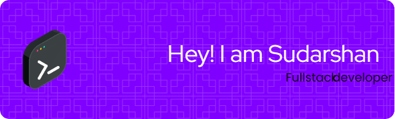

# Hi there, I'm Sudarshan H! 👋

I’m a passionate developer with a focus on fullstack web development and a knack for building scalable and efficient applications. Currently honing my skills in JavaScript, data structures, and algorithms, while diving into deployment strategies for web applications.

### 🚀 Skills & Technologies:
- **Languages**: JavaScript, HTML, CSS
- **Frameworks & Libraries**: React, Node.js, Express
- **Databases**: MongoDB, SQL
- **Other Tools**: Git, Docker, Nginx

### 🌱 What I'm Currently Learning:
- Advanced JavaScript Data Structures & Algorithms
- Cloud deployment strategies (AWS, Netlify, Vercel)
- Building scalable fullstack applications

<!---
sudarshanHosalli/sudarshanHosalli is a ✨ special ✨ repository because its `README.md` (this file) appears on your GitHub profile.
You can click the Preview link to take a look at your changes.
--->
